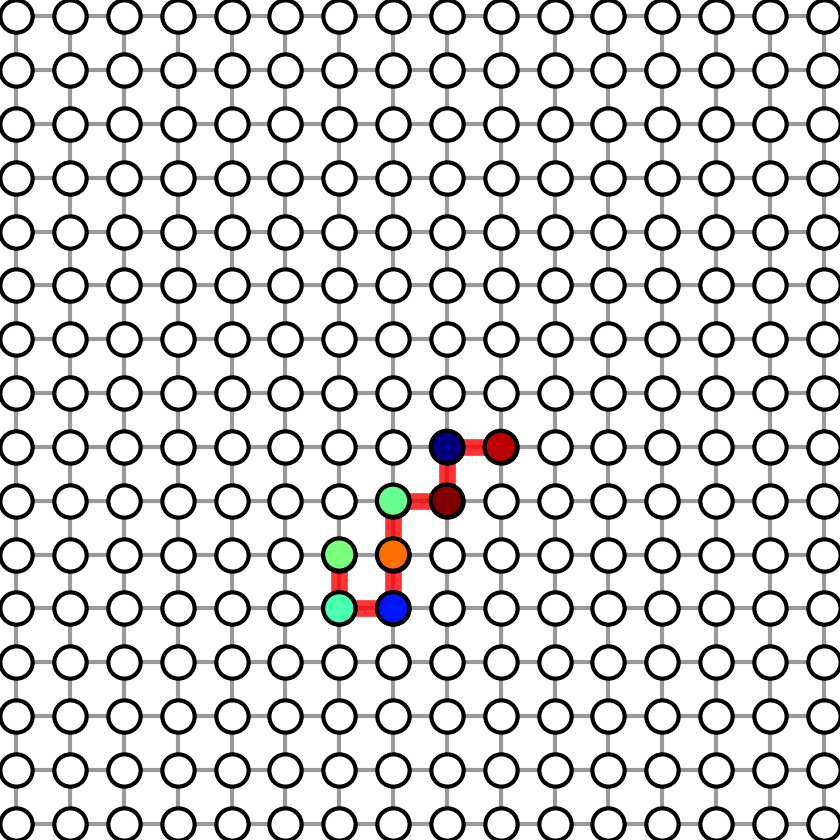
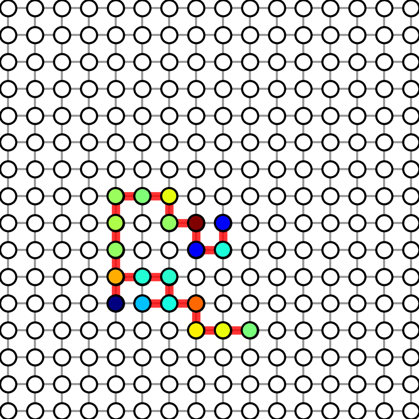
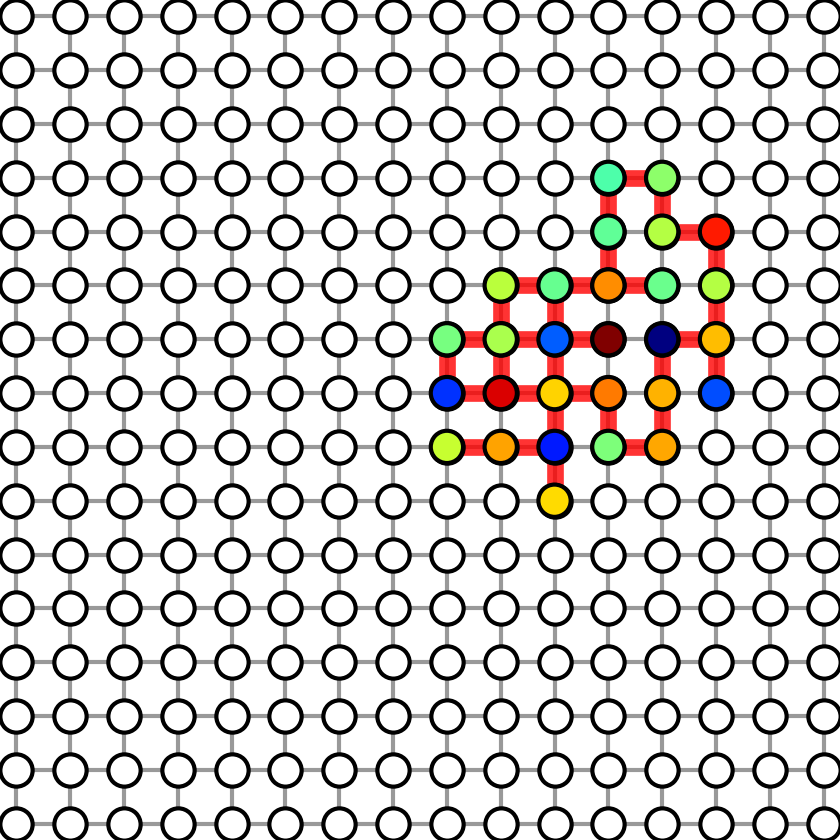
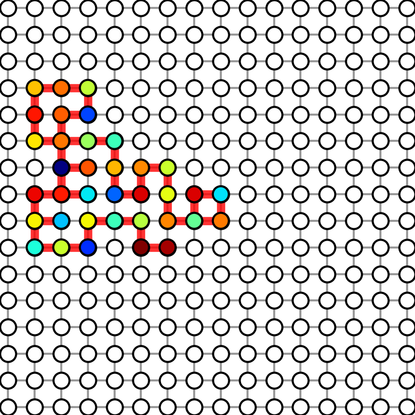
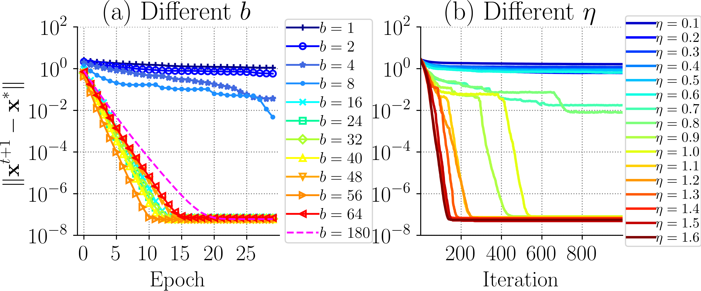
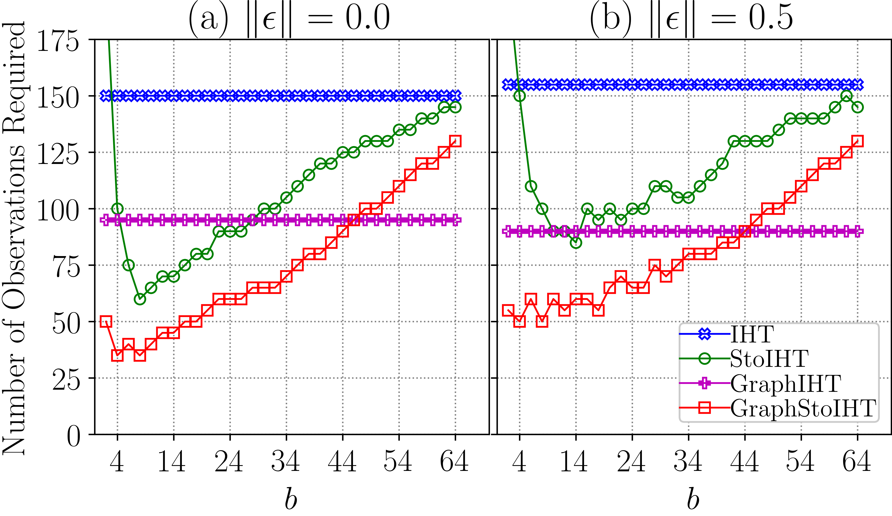
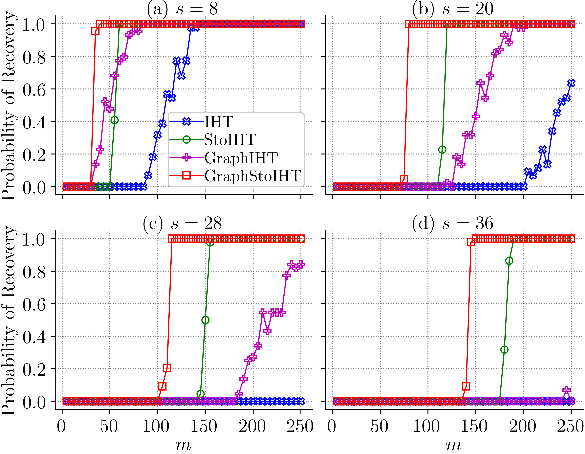
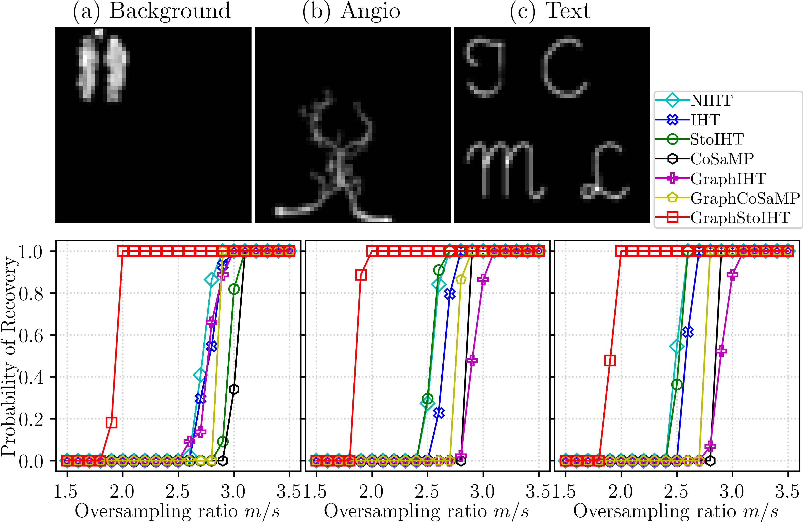
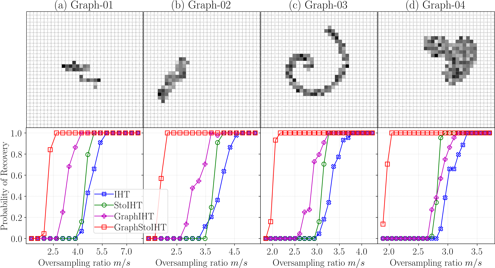
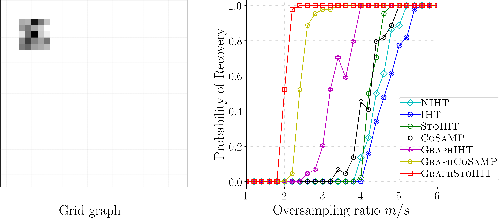

## Stochastic IHT for Graph-structured Sparsity  Optimization

## Overview

Welcome to the repository of GraphStoIHT! This repository is only for 
reproducing all experimental results shown in our paper. To install it via pip, 
please try [sparse-learn](https://github.com/baojianzhou/sparse-learn). 
Our work is due to several seminal works including 
[StoIHT](https://ieeexplore.ieee.org/abstract/document/8025727),
[AS-IHT](http://papers.nips.cc/paper/6483-fast-recovery-from-a-union-of-subspaces), 
and [GraphCoSaMP](http://people.csail.mit.edu/ludwigs/papers/icml15_graphsparsity.pdf).
More details of GraphStoIHT can be found in: "Baojian Zhou, Feng Chen, and Yiming Ying, 
Stochastic Iterative Hard Thresholding for Graph-structured Sparsity
Optimization, ICML, 2019".

Our code is written in Python and C11. The implementation of head and tail 
projection are almost directly from Dr. Ludwig's excellent code
[cluster_approx](https://github.com/ludwigschmidt/cluster_approx), 
[graph_sparsity](https://github.com/ludwigschmidt/graph_sparsity_experiments) and
[pcst_fast](https://github.com/fraenkel-lab/pcst_fast). I used C to reimplement 
these two projections is to get a little bit faster speed by using continuous 
memory (but the improvement is not significant at all!). As we pointed in 
[sparse-learn](https://github.com/baojianzhou/sparse-learn), you 
can install GraphStoIHT via the following command:
 ```angular2html
$ pip install sparse-learn
```

After install it, you can use it via the following python interface
```Python
import splearn as spl
``` 

## Instructions

The code has been tested on a GNU/Linux system. The dependencies of our programs 
are Python2.7(with numpy) and GCC.  This section is to tell you how to 
prepare the environment. It has four steps:

    0.  clone our code website: git clone https://github.com/baojianzhou/graph-sto-iht.git

    1.  install Python-2.7 and GCC (Linux/MacOS/MacBook users skip this!)

    2.  install numpy, matplotlib (optional), and networkx (optional).

    3.  after the above three steps, run: python setup.py build_ext --inplace.

After step 3, it will generate a sparse_module.so file. We are ready to 
show/replicate the results reported in our paper.

### 1. Figure 1

Figure 1 shows the subgraphs used in graph sparse linear regression. 
To generate Figure-1, run:

```sh
$ python exp_sr_test01.py gen_figures
```
Four figures will be generated in results folder. We show the four generated figures
in the following.

Graph with sparsity 8 |  Graph with sparsity 20 |  Graph with sparsity 28 |  Graph with sparsity 36
:-------------------------:|:-------------------------:|:-------------------------:|:-------------------------|
 |   |  |   


### 2. Figure 2

To show Figure-2, run:

```sh
$ python exp_sr_test02.py show_test
```
To reproduce Figure-2, run:

```sh
$ python exp_sr_test02.py run_test 4
```
Here, the parameter 4 is the number of CPU will be used. The left illustrates 
the estimation error as a function of epochs for different choices of b. When 
b= 180, it degenerates to GraphIHT (the dashed line).  The right part 
shows the estimation error as a function of iterations for different choices of η.
It shows that when the sample size is suitable, the algorithm converges faster than
batch method.

<p align="center">

</p>

### 3. Figure 3

To show Figure-3, run:
            
```sh
$ python exp_sr_test03.py show_test
```
To reproduce Figure-3, run:

```sh
$ python exp_sr_test03.py run_test 4 0 50
```
Here, 4 is the number of CPUs used for each program. 0 is the start 
of the trial id. 50 is the end of the trial id. It means we try to run 
50 trials and then take the average. The figure shows the robustness to noise.
The number of observations required is a function of different block sizes.

<p align="center">

</p>

### 4. Figure 4

To show Figure-4, run:
            
```sh
$ python exp_sr_test01.py show_test
```
To reproduce Figure-4, run:

```sh
$ python exp_sr_test01.py run_test 4 0 50
```
Here, 4 is the number of CPUs used for each program. 0 is the start 
of the trial id. 50 is the end of the trial id. It means we try to run 
50 trials and then take the average. The figure shows the probability of 
recovery on synthetic dataset. The probability of recovery is a function of 
the number of observations m.

<p align="center">

</p>


### 5. Figure 5

To show Figure-5, run:
            
```sh
$ python exp_sr_test06.py show_test
```
To reproduce Figure-5, run:

```sh
$ python exp_sr_test06.py run_test 4 0 50
```
<p align="center">

</p>
Probability of recovery on three 50×50 resized real im-ages.

            
### 6. Figure 6

To show Figure-6, run:
            python exp_sr_test04.py show_test

To generate results of Figure-6, run:
            python exp_sr_test04.py run_test 4 0 50

<p align="center">

</p>

The probability of recovery as a function of oversampling ratio. The oversampling ratio is defined as the number of observations m divided by sparsity s, i.e.,m/s. These four public benchmark graphs (a), (b), (c), and (d) in the upper row are from Arias-Castro et al.(2011)

            
### 7. Figure 7
To show Figure-7, run:
            python exp_sr_test05.py show_test
            
To generate results of Figure-7, run:
            python exp_sr_test05.py run_test 4 0 50

<p align="center">

</p> 

### 8. Figure 8
To generate Table 2, 3, 4, 5, run:
            python exp_bc_run.py show_test

            
------------------------------------------------------------------------------
This section describes how to reproduce the results. In the following commands,
--4     means the number of cpus used for each program.
--0     means the start of the trial id.
--50    means the end of the trial id.


To generate results of Table 2, 3, 4, 5, run:
            python exp_bc_run.py run_test 0 20

### L1/L2-based methods
How to run l1/l2-mixed norm methods? You can first download 
[Overlasso](https://lbbe.univ-lyon1.fr/-Jacob-Laurent-.html?lang=fr). We 
downloaded it in overlasso-package. Run those l1/l2-mixed norm methods 20 times and
then generate the data and results in results folder.

### Concerns and Issues
This section describes how to run 
GraphStoIHT and all baselines. The $\ell_1$ norm-based method is downloaded from 
[OverLasso](http://lbbe.univ-lyon1.fr/-Jacob-Laurent-.html?lang=fr). 
It contains all l1/l2 mixed-norm methods.
Since we reported results based 50 trials, some programs above are time-cost 
if you only use 4 CPUs. A better way is to test them on 5/10 trials by replacing 
50 with 5/10. You should be approximately able to reproduce our results. If you 
cannot reproduce the results pleased email: bzhou6@albany.edu.  We can discuss 
any concerns and potential issues could occur.  Thank you in advance!


------------------------------------------------------------------------------
This section describes 
